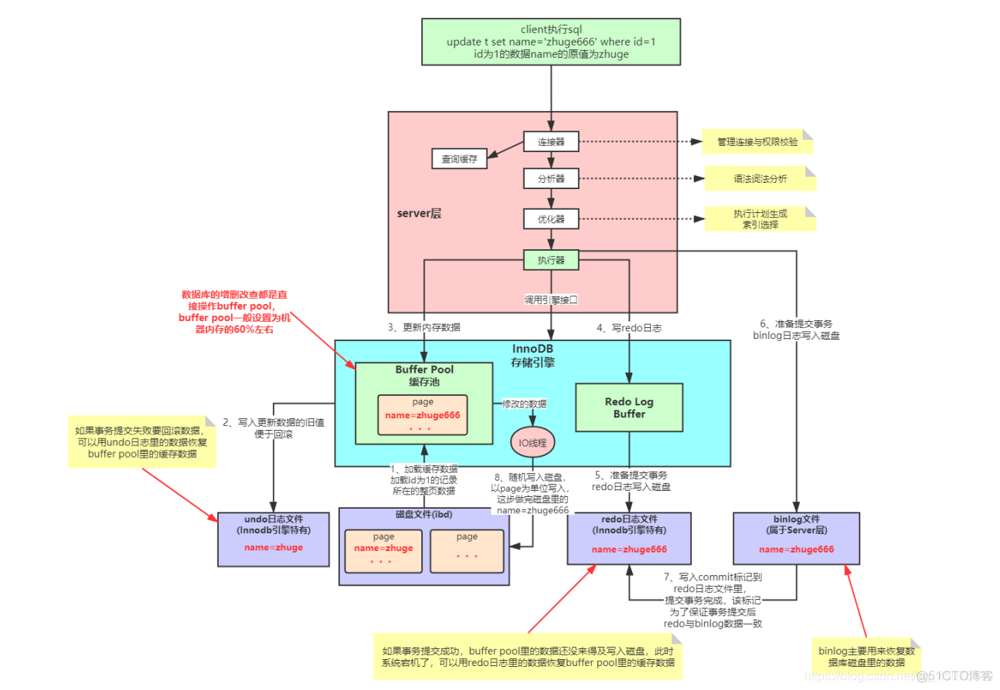
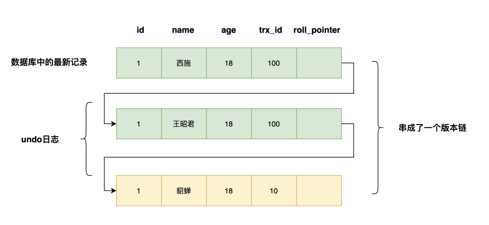
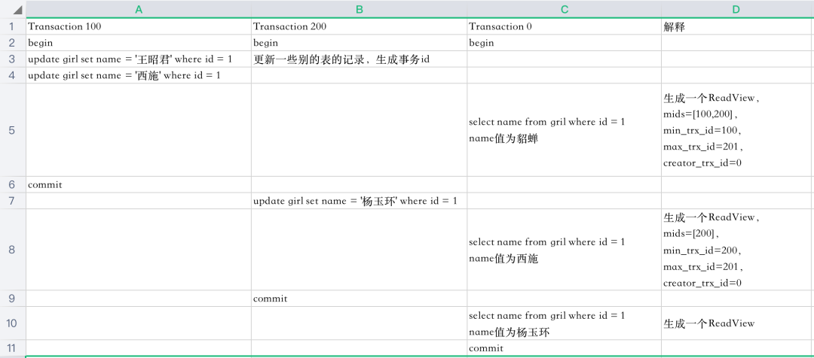
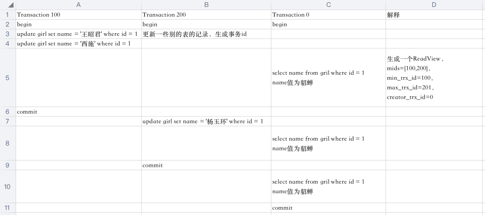
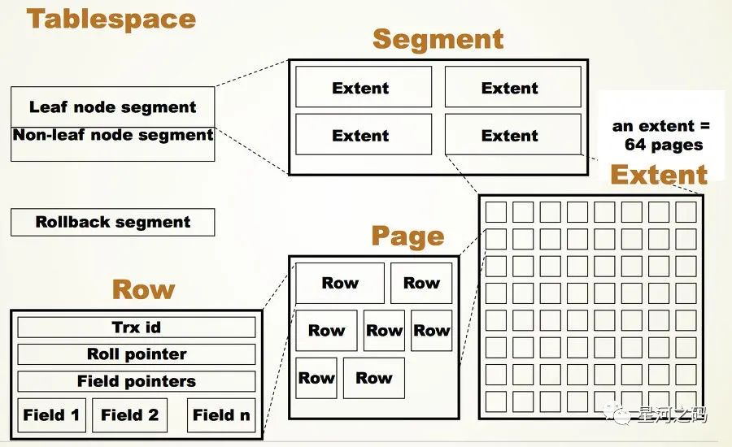
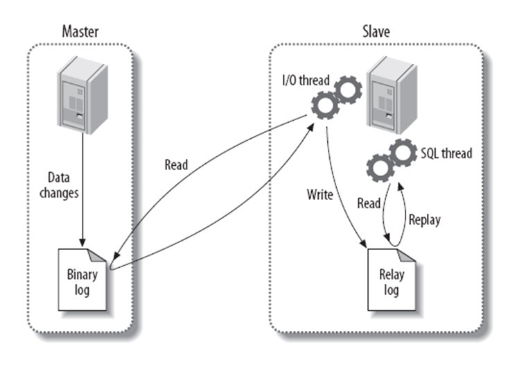

# mysql

## 一条sql的执行流程



步骤：

一：客户端层
id为1的name字段原来的值是zhuge。

①：mysql的客户端执行sql

 ```sql
update t set name = 'zhuge666' where id = 1   
 ```

二：mysql服务器层
②： 进入mysql服务器，由连接器验证账号密码等身份信息，验证通过去查mysql缓存，如果有，直接返回。没有进入分析器。
③：进入mysql的分析器，分析sql语句是否符合mysql规范。
④：进入sql优化器，mysql底层优化sql，比如调换索引列等。
⑤：进入执行器，执行sql。
        
三：innoDB引擎层
mysql服务层后边连接了很多引擎层，如MyIsam、innoDB等，这里只分析innoDB引擎。

⑥：加载磁盘上id为1的整页数据到 buff pool缓存池中，此时buff pool中的name值为zhuge，为什么加载整页，因为磁盘上存储数据都是整页整页存的。这里要注意：mysql加载数据是整页整页加载的！！
⑦：把buff pool中的 旧值 zhuge 写入undo日志版本链，方便事务提交失败后回滚，回滚时直接从undo日志版本链中取值即可。
⑧：在buff pool中把新的值 zhuge666 赋给 name，注意此时只有buff pool中的name属性做了更新，磁盘上的文件还是原来的旧值 zhuge。
⑨：执行器把更新的操作先写入内存中的Redo Log buffer（Redo日志缓冲区）
⑩：把Redo日志缓冲区分批次顺序写入inndb独有的redo磁盘日志文件中，此时准备提交事务
⑪：把更新操作写入binlog日志，内容与redo日志差不多，属于mysql服务层，所有引擎层都有这一步操作。此时还是准备提交事务中，还没提交 。
⑫：写一个commit标记到redo日志中去，该标记为了保证事务提交后，redo日志和binlog日志数据一致。此时才标志着提交事务完成
问题一：binlog为什么要给redo日志中写一个commit标记？

        binlog主要用于恢复数据，提交事务时，要给redo日志中写一个commit标记可以保证binlog日志中的数据与redo日志中的数据保持一致性

问题二：磁盘文件的数据什么时候更新？

        不确定，有一个后台io线程从Buffer pool缓存池中随机以页为单位写入磁盘。

问题三：如果事务提交后，数据库服务挂了，此时buff pool的数据还没来得及更新到磁盘上，怎么办？

        当再次重启服务器时，可以使用redo日志里的数据恢复buff pool中的数据，后台线程再把数据从buff pool中写入磁盘，这也是redo日志的最主要作用

问题四：为什么Mysql不能直接更新磁盘上的数据，而是设置这么一套复杂的机制来执行SQL？

①：内存操作，异步刷盘：如果每个请求都要来更新磁盘，数据库性能将特别差。利用buff poll缓存池在内存中操作数据，定时写入磁盘，大大提高了数据库性能。
②：redo日志顺序写入磁盘：redo日志虽然也使用磁盘存储，但相对与直接随机读写磁盘来说，redo日志是顺序写磁盘日志文件的。顺序写入的速度远高于随机写入，同时redo日志还能保证各种异常情况下的数据一致性。
        正是通过这套机制，才能让我们的MySQL数据库在较高配置的机器上每秒可以抗下几干的读写请求。
        

2. undo日志、redo日志、binlog日志的区别？
三种日志都写入磁盘！不过undo日志和redo日志是innoDB存储特有的，binlog日志是所有存储引擎都有的！

undo日志：主要用于mvcc机制的实现，还有事务回滚也可直接从undo日志中取到原始值
redo日志：主要用于防止mysql宕机时，buff pool中的数据还未来得及写入磁盘，导致数据丢失。使用redo日志可在mysql宕机后再启动时，把数据恢复到buff pool中。第二点就是等待binlog日志发送commit标记后才提交事务，保证与binlog日志文件数据一致！

binlog日志：主要用于数据库数据误删恢复，主从复制

>https://blog.51cto.com/u_15281317/2942322

## 事务

### 事务的隔离级别

1. 串行化

   多个事务只能一个一个执行，表现为串行化。可以解决幻读问题。

   如何才能实现串行化呢？它是在每个读的数据行上加上共享锁。在这个级别，可能导致大量的超时现象和锁竞争。

2. 可重复读    [幻读] 

   多个并发事务中，被某个事务A读取的行不可以被其他的事务B或C写（修改），但是可以往表中新增数据。有**幻读问题**，可通过间隙锁解决。

3. 读取提交内容     [不可重复读、幻读]

   多个并发事务中，被某个事务A读取的行是被其他事务B或C提交了的，但是可能前后两次读取的数据不一致，因为两次之间有其他事务提交了行数据。

4. 读取未提交内容   [脏读、不可重复读、幻读]

   随机读，事务A读取的数据，事务B或C可以随意修改，甚至未提交的数据也可以读取到，有**脏读问题**。

   

事务隔离级别都是表象，是数据库的规范，核心是怎么实现它，这里只研究mysql

##### mysql锁：

| 互斥性 | S    | X    |
| ------ | ---- | ---- |
| S      | 兼容 | 互斥 |
| X      | 互斥 | 互斥 |

##### 表锁：

​	在系统变量autocommit=0，innodb_table_locks = 1时，手动获取InnoDB存储引擎提供的表t的S锁或者X锁，可以这么写

1. 共享锁（S锁）

   ```sql
   lock tables t read
   ```

2. 排他锁（X锁）

   ```sql
   lock tables t write
   ```

   对表结构进行修改的时候，比如ALTER TABLE，DROP TABLE 的时候会加表X锁  

   可以手动加S表锁，那么Innodb加了S锁后,其他事务还可以获取S表锁，但是不能获取X锁。

#### 记录锁（行锁）

1. 共享锁

2. 排他锁

3. 间隙锁  记录锁   临键锁(间隙锁+记录锁)

4. 可以主动加锁

5. 举例

   | id   | name | age  |
   | ---- | ---- | ---- |
   | 1    | 张三 | 10   |
   | 2    | 李四 | 12   |
   | 8    | 王五 | 3    |

   

   1. update  table_name  set  name =  'job' where  id  = 1 for  update   这里就给id=1的记录加了记录锁

   2. update  table_name  set  name =  'job' where  id  = 5 for  update   这就加上了间隙锁  锁住了  (2 , 8)

      引申：间隙锁是锁住两个值之前的间隙，要锁住最后一条记录后面的间隙怎么办，可以使用mysql的分页结构，每一页上都有supernum这个记录，代表∞

   3. update  table_name  set  name =  'job' where  id  >= 2 for  update   这就加上了临键锁，锁住了  [2 , ∞)

### Innodb如何实现事务隔离?什么是MVCC!!!

innodb通过mvcc实现  **读已提交** 和 **可重复度**

1. mvcc时什么：  多版本并发控制技术，其基本思想是为每次事务生成一个新版本的数据，在读取时选择不同版本的数据即可以实现对事务完整结果的读取（在其他的并发应用中也有）

2. 作用：提高并发的读写性能，因为读可以不用加锁了

   **增删改的时候会生成事务id**  

   开启标志：任何一条DML语句(insert、update、delete)执行，事务开启。set autocommit=0 控制事务自动提交而已。

   - 每一条record里面都包含三个隐藏字段  row_id, tx_id, roll_pointer 

     - row_id 自增的行id，如果没有指定主键，innodb会默认以此字段为主键 
     - tx_id 记录最后被哪个事务修改，这里存的就是哪个事务id
     - roll_pointer 回滚指针，每次对某条聚集索引记录进行改动时，都会把旧的版本写入undo日志中。这个隐藏列就相当于一个指针，通过他找到该记录修改前的信息，其实也是该条数据最新的undo log记录

   - undo log中的记录，和数据库中的记录格式一样，回滚指针指向前一条undo log记录(如果有的话)

     >undo log番外篇  目的是为了事务回滚用的，那么我们不需要保存太多数据，策略不秦楚，但是可以设置文件滚动使用

   - **mvcc开始工作：**

   - 当事务中有查询语句时，生成一个**readView**,以下时它的主要组成部分

     - **「m_ids」**：在生成ReadView时，当前系统中**活跃的事务id列表**
     - **「min_trx_id」**：在生成ReadView时，当前系统中活跃的最小的事务id，也就是m_ids中的最小值
     - **「max_trx_id」**：在生成ReadView时，系统应该分配给下一个事务的事务id值（因为事务id是自增的）
     - **「creator_trx_id」**：生成该ReadView的事务的事务id，如果查询事务中没有cud操作，那么当前事务id为0

   - 举例说明

   - **读已提交**:**每次读取数据前都生成一个ReadView**

   - 

     下面是3个事务执行的过程，一行代表一个时间点

     

     **「先分析一下5这个时间点select的执行过程」**

     1. 系统中有两个事务id分别为100，200的事务正在执行
     2. 执行select语句时生成一个ReadView，mids=[100,200]，min_trx_id=100，max_trx_id=201，creator_trx_id=0（select这个事务没有执行更改操作，事务id默认为0）
     3. 最新版本的name列为西施，该版本trx_id值为100，在mids列表中，不符合可见性要求，根据roll_pointer跳到下一个版本
     4. 下一个版本的name列王昭君，该版本的trx_id值为100，也在mids列表内，因此也不符合要求，继续跳到下一个版本
     5. 下一个版本的name列为貂蝉，该版本的trx_id值为10，小于min_trx_id，因此最后返回的name值为貂蝉
     
     

**Repeatable Read（可重复读），在第一次读取数据时生成一个ReadView**



### 串行化如何实现

当我们设置innodb隔离级别为串行化的时候，引擎会使用间隙锁达到串行化的效果，以解决幻读。

当然可能也是表锁，当我们的查询范围没有走索引（全表扫描）的时候。加共享锁（S锁）即可。

间隙锁是给不存在的数据记录的范围加锁：

对于辅助索引，若值允许重复，在串行隔离级别中如果进行等值查询，InnoDB会给数据加上行锁和间隙锁（防止别的事务插入索引值重复的数据，造成幻读）
对于主键索引，或者唯一键索引，值不允许重复，那只需要加行锁就够了（对于唯一键索引，不可能发生插入索引值重复的数据）

### mysql innodb文件体系



https://blog.csdn.net/Edwin_Hu/article/details/124698400

### 优化锁方面的意见？

* 使用较低的隔离级别
* 设计索引，尽量使用索引去访问数据，加锁更加精确，从而减少锁冲突
* 选择合理的事务大小，给记录显示加锁时，最好一次性请求足够级别的锁。列如，修改数据的话，最好申请排他锁，而不是先申请共享锁，修改时在申请排他锁，这样会导致死锁
* 不同的程序访问一组表的时候，应尽量约定一个相同的顺序访问各表，对于一个表而言，尽可能的固定顺序的获取表中的行。这样大大的减少死锁的机会。
* 尽量使用相等条件访问数据，这样可以避免间隙锁对并发插入的影响
* 不要申请超过实际需要的锁级别
* 数据查询的时候不是必要，不要使用加锁。MySQL的MVCC可以实现事务中的查询不用加锁，优化事务性能：MVCC只在committed read（读提交）和 repeatable read （可重复读）两种隔离级别
* 对于特定的事务，可以使用表锁来提高处理速度减少死锁的可能。

### 分库分表

#### 1. 为什么要分库分表？

**分表**

比如你单表都几千万数据了，你确定你能扛住么？绝对不行，单表数据量太大，会极大影响你的 sql执行的性能，到了后面你的 sql 可能就跑的很慢了。一般来说，就以我的经验来看，单表到几百万的时候，性能就会相对差一些了，你就得分表了。

分表就是把一个表的数据放到多个表中，然后查询的时候你就查一个表。比如按照用户 id 来分表，将一个用户的数据就放在一个表中。然后操作的时候你对一个用户就操作那个表就好了。这样可以控制每个表的数据量在可控的范围内，比如每个表就固定在 200 万以内。

**分库**

分库就是你一个库一般我们经验而言，最多支撑到并发 2000，一定要扩容了，而且一个健康的单库并发值你最好保持在每秒 1000 左右，不要太大。那么你可以将一个库的数据拆分到多个库中，访问的时候就访问一个库好了。

这就是所谓的分库分表。

#### 分库分表中间件 sharding-jdbc

当当开源的，属于 client 层方案。确实之前用的还比较多一些，因为 SQL 语法支持也比较多，没有太多限制，而且目前推出到了 2.0 版本，支持分库分表、读写分离、分布式 id 生成、柔性事务（最大努力送达型事务、TCC 事务）。而且确实之前使用的公司会比较多一些（这个在官网有登记使用的公司，可以看到从 2017 年一直到现在，是有不少公司在用的），目前社区也还一直在开发和维护，还算是比较活跃，个人认为算是一个现在也**可以选择的方案**。

## 4. MySQL主从复制流程和原理？

基本原理流程，是3个线程以及之间的关联

主：binlog线程——记录下所有改变了数据库数据的语句，放进master上的binlog中；

从：io线程——在使用start slave 之后，负责从master上拉取 binlog 内容，放进自己的relay log中；

从：sql执行线程——执行relay log中的语句；

**复制过程如下**：



Binary log：主数据库的二进制日志

Relay log：从服务器的中继日志

第一步：master在每个事务更新数据完成之前，将该操作记录串行地写入到binlog文件中。

第二步：salve开启一个I/O Thread，该线程在master打开一个普通连接，主要工作是binlog dump process。如果读取的进度已经跟上了master，就进入睡眠状态并等待master产生新的事件。I/O线程最终的目的是将这些事件写入到中继日志中。

第三步：SQL Thread会读取中继日志，并顺序执行该日志中的SQL事件，从而与主数据库中的数据保持一致。

## 5. MySQL主从同步延时问题如何解决？

MySQL 实际上在有两个同步机制，一个是半同步复制，用来 解决主库数据丢失问题；一个是并行复制，用来 解决主从同步延时问题。

- 半同步复制，也叫 semi-sync 复制，指的就是主库写入 binlog 日志之后，就会将强制此时立即将数据同步到从库，从库将日志写入自己本地的 relay log 之后，接着会返回一个 ack 给主库，主库接收到至少一个从库的 ack 之后才会认为写操作完成了。
- 并行复制，指的是从库开启多个线程，并行读取 relay log 中不同库的日志，然后并行重放不同库的日志，这是库级别的并行。

## 3. 超大分页怎么处理?

数据库层面,这也是我们主要集中关注的(虽然收效没那么大),类似于`select * from table where age > 20 limit 1000000`,10 这种查询其实也是有可以优化的余地的. 这条语句需要 load1000000 数据然后基本上全部丢弃,只取 10 条当然比较慢. 当时我们可以修改为`select * from table where id in (select id from table where age > 20 limit 1000000,10)`.这样虽然也 load 了一百万的数据,但是由于索引覆盖,要查询的所有字段都在索引中,所以速度会很快。

解决超大分页,其实主要是靠缓存,可预测性的提前查到内容,缓存至redis等k-V数据库中,直接返回即可.

在阿里巴巴《Java开发手册》中,对超大分页的解决办法是类似于上面提到的第一种.

> 【推荐】利用延迟关联或者子查询优化超多分页场景。 
>
> 说明：MySQL并不是跳过offset行，而是取offset+N行，然后返回放弃前offset行，返回N行，那当offset特别大的时候，效率就非常的低下，要么控制返回的总页数，要么对超过特定阈值的页数进行SQL改写。 
>
> 正例：先快速定位需要获取的id段，然后再关联： 
>
> SELECT a.* FROM 表1 a, (select id from 表1 where 条件 LIMIT 100000,20 ) b where a.id=b.id

## 6. 如何优化关联查询

- 确定ON或者USING子句中是否有索引。
- 确保GROUP BY和ORDER BY只有一个表中的列，这样MySQL才有可能使用索引。