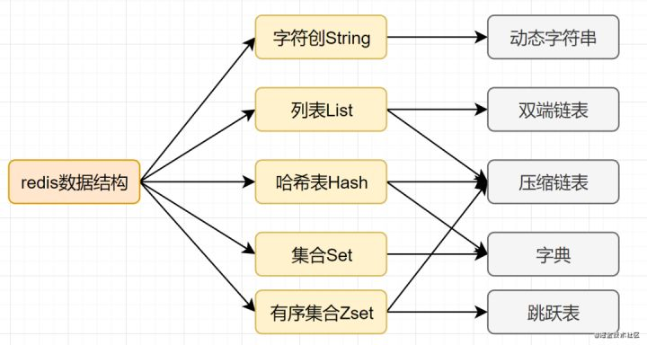
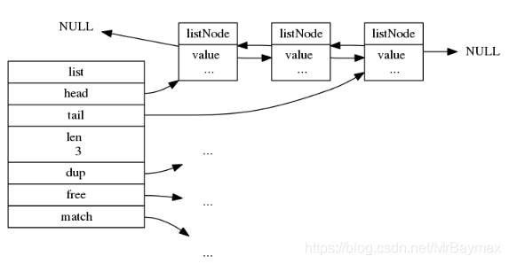

# redis

## redis基础设计问题

### redis数据结构

>redis五中常见结构   string  list  set  zset  hashmap
>
>三种特殊结构  geo   hyperloglog    bitmap
>
>redis多种编码方式  String: int(8)[]  embstr(39)   raw    ziplist   linkedlist   intset   hashtable   skiplist

#### redis string

如果都是int类型的话  int(8)   9~39  embstr    40~∞   raw

redis的字符串用的是SDS(simple dynamic string)  其结构如下

```c
struct sdshdr{ unsigned int len; // 标记buf的长度 
              unsigned int free; //标记buf中未使用的元素个数 
              char buf[]; // 存放元素的坑 
             }
```

核心是可以预分配内存，获取字符串长度复杂度O(1)。

#### redis list

编码方式: ziplist  linkedlist

可实现的数据类型： 栈    队列    数组    有限集合

#### redis  hashmap

编码方式：ziplist  hashtable

存对象

#### redis set

编码方式：intset  hashtable

应用场景：用户标签,生成随机数抽奖、社交需求

#### 注意：

 smembers和lrange、hgetall都属于比较重的命令，如果元素过多存在阻塞Redis的可能性，可以使用sscan来完成。

#### redis zset

编码方式：ziplist skiplist

使用场景：排行榜   

#### redis 三种特殊数据结构

- Geo：Redis3.2推出的，地理位置定位，用于存储地理位置信息，并对存储的信息进行操作。
- HyperLogLog：用来做基数统计算法的数据结构，如统计网站的UV。
- Bitmaps ：用一个比特位来映射某个元素的状态，在Redis中，它的底层是基于字符串类型实现的，可以把bitmaps成作一个以比特位为单位的数组

#### redis 内部编码方式及数据结构



##### **ziplist**

ziplist是Redis中的某些数据类型底层所使用的数据结构

Redis中的hash，List，Sorted List这几种类型的数据在某些情况下会使用ziplist来存储。

- **Hash类型**
  当hash类型的数据满足以下条件时，底层使用ziplist存储。

  当hash键值对个数小于等于 hash-max-ziplist-entries 配置的值，默认512
  当键值对中值的长度小于等于 hash-max-ziplist-value 配置的值，默认64
  当hash类型的数据同时满足以上两个条件时，会将value采用ziplist来存储

- **List类型**

  redis中list类型的数据底层是使用quicklist来存储的，而quicklist是基于linkedlist + ziplist实现的。

- **Sorted Set类型**
  当Sorted Set类型的数据满足以下条件时，底层使用ziplist存储。

  当元素个数小于等于 zset-max-ziplist-entries配置的值，默认128
  每个元素的值小于等于 zset-max-ziplist-value配置
  当Sorted Set类型的数据同时满足以上两个条件时，会将value采用ziplist来存储。

###### **ziplist的内存布局**

ziplist是由一系列特殊编码的连续内存块组成的顺序存储结构，类似于数组，ziplist在内存中是连续存储的，但是不同于数组，为了节省内存 ziplist的每个元素所占的内存大小可以不同，每个节点可以用来存储一个整数或者一个字符串。

ziplist类似于双向链表，但是它不存储上一个节点和下一个节点的指针，而是存储上一个节点长度和当前节点长度，通过牺牲部分读写性能，来换取高效的内存空间利用率，节约内存。


- zlbytes：记录了压缩列表占用的内存字节数，在对压缩列表进行内存重分配，或者计算zlend的位置时使用。它本身占了4个字节。

- zltail：记录了尾节点（entry）至起始节点（entry）的偏移量。通过这个偏移量，可以快速确定最后一个entry节点的地址。

- zllen：记录了entry节点的数量。当zllen的值小于65535时，这个值就表示节点的数量。当zllen的值大于65535时，节点的真实数量需要遍历整个压缩列表才能得出。

- entry：压缩列表中所包含的每个节点。每个节点的长度根据该节点的内容来决定。

- zlend：特殊值0XFF，标记了压缩列表的末端。表示该压缩列表到此为止。

  值得注意的是，这个压缩列表的内存空间是连续的。这也是压缩列表的主要特点，空间连续，避免内存碎片，节省内存。

  entry是链表中的一个节点，代表了一个数据。

  redis中对压缩列表中节点的定义如下：

  ```c
  typedef struct zlentry {
      unsigned int prevrawlensize; /*存储上一个节点长度的数值所需要的字节数*/
      unsigned int prevrawlen;     /* 上一个节点的长度 */
      unsigned int lensize;        /* 当前节点长度的数值所需要的字节数*/
      unsigned int len;            /* 当前节点的长度 */
      unsigned int headersize;     /* 当前节点的头部大小，值 = prevrawlensize + lensize. */
      unsigned char encoding;      /* 编码方式，ZIP_STR_* 或 ZIP_INT_* */
      unsigned char *p;            /* 指向节点内容的指针. */
  } zlentry;
  ```

  虽然定义了这个结构体，但是根本就没有使用zlentry结构来作为压缩列表中用来存储数据节点中的结构，因为，这个结构存小整数或短字符串实在是太浪费空间了。这个结构总共在32位机占用了28个字节(32位机)，在64位机占用了32个字节。这不符合压缩列表的设计目的：提高内存的利用率。因此，在redis中，并没有定义结构体来进行操作，而是定义了一些宏，压缩列表的节点真正的结构如下图所示：

  

  - prev_entry_len：记录**前驱节点的长度。**
  - encoding：记录**当前节点**的value成员的**数据类型以及长度。**
  - value：根据encoding来保存**字节数组或整数**。

###### **ziplist的特点**

1. 压缩列表ziplist结构本身就是一个连续的内存块，由表头、若干个entry节点和压缩列表尾部标识符zlend组成，通过一系列编码规则，提高内存的利用率，使用于存储整数和短字符串。
2. 压缩列表ziplist结构的缺点是：每次插入或删除一个元素时，都需要进行频繁的进行内存的扩展或减小，然后进行数据”搬移”，甚至可能引发连锁更新，造成严重效率的损失。

##### hashtable

###### 字典的作用

redis的字典是一个用于维护key和value映射关系的[数据结构](https://so.csdn.net/so/search?q=数据结构&spm=1001.2101.3001.7020)，与Java中的Map类似。在字典中维护了两个存放数据指针的hash表。同时字典中维护了对hash表的扩容，缩容，key的hash算法等操作。

```c
typedef struct dict {
    dictType *type;  
    void *privdata;  //私有数据指针（privdata）由调用者在创建dict的时候传进来,在dictType的某些操作被调用时会传回给调用者
    dictht ht[2];	  //底层用来存数据的hash表 2个
    long rehashidx;   // rehash的索引。 渐进式rehash时用到	
    int16_t pauserehash; //暂停rehash的标志。 >0表示已暂停。 <0表示编码错误 =0表示正在rehash
} dict;
```

在dict中，ht 属性是一个包含两个项的数组， 数组中的每个项都是一个 dictht 哈希表， 一般情况下， 字典只使用 ht[0] 哈希表， ht[1] 哈希表只会在对 ht[0] 哈希表进行 rehash 时使用。

除了 ht[1] 之外， 另一个和 rehash 有关的属性就是 rehashidx ： 它记录了 rehash 目前的进度， 如果目前没有在进行 rehash ， 那么它的值为 -1 。

dictht的定义：

```c
typedef struct dictht {        
     dictEntry **table;// 哈希表数组
     unsigned long size; // 哈希表大小
     unsigned long sizemask;// 哈希表大小掩码，用于计算索引值  总是等于 size - 1
     unsigned long used; // 该哈希表已有节点的数量 
} dictht;
```

>table 属性是一个数组， 数组中的每个元素都是一个指向 dict.h/dictEntry 结构的指针， 每个 dictEntry 结构保存着一个键值对。
>
>size 属性记录了哈希表的大小， 也即是 table 数组的大小
>
>sizemask 属性的值总是等于 size-1 ， 这个属性和哈希值一起决定一个键应该被放到 table 数组的哪个索引上面。(不是很清楚，为什么要单独定义一个mask，而不直接size-1)；
>
>而 used 属性则记录了哈希表目前已有节点（键值对）的数量。

###### 字典的rehash

随着操作的不断执行， 哈希表保存的键值对会逐渐地增多或者减少， 为了让哈希表的负载因子（load factor）维持在一个合理的范围之内， 当哈希表保存的键值对数量太多或者太少时， 程序需要对哈希表的大小进行相应的扩展或者收缩。

也就是我们常说的，扩容，再次hash。

Redis rehash过程：

为字典的 ht[1] 哈希表分配空间。一般为原字典的两倍，即 ht[0] * 2；
将保存在 ht[0] 中的所有键值对 rehash 到 ht[1] 上面
当 ht[0] 包含的所有键值对都迁移到了 ht[1] 之后 （ht[0] 变为空表）， 释放 ht[0] ， 将 ht[1] 设置为 ht[0] ， 并在 ht[1] 新创建一个空白哈希表， 为下一次 rehash 做准备。
但其实rehash是非常的耗时间的。假设ht[0]非常的大呢？ 40W，400W，甚至4000W呢？

一次rehash甚至可能导致redis宕机，所以出现了渐进式hash。

###### 渐进式Rehash

这个 rehash 动作并不是一次性、集中式地完成的， 而是分多次、渐进式地完成的。为了避免 rehash 对服务器性能造成影响， 服务器不是一次性将 ht[0] 里面的所有键值对全部 rehash 到 ht[1] ， 而是分多次、渐进式地将 ht[0] 里面的键值对慢慢地 rehash 到 ht[1] 。

为 ht[1] 分配空间， 让字典同时持有 ht[0] 和 ht[1] 两个哈希表。
在字典中维持一个索引计数器变量 rehashidx ， 并将它的值设置为 0 ， 表示 rehash 工作正式开始。
在 rehash 进行期间， 每次对字典执行添加、删除、查找或者更新操作时， 程序除了执行指定的操作以外， 还会顺带将 ht[0] 哈希表在 rehashidx 索引上的所有键值对 rehash 到 ht[1] ， 当 rehash 工作完成之后， 程序将 rehashidx 属性的值增一。
随着字典操作的不断执行， 最终在某个时间点上， ht[0] 的所有键值对都会被 rehash 至 ht[1] ， 这时程序将 rehashidx 属性的值设为 -1 ， 表示 rehash 操作已完成。

在进行渐进式 rehash 的过程中， 字典会同时使用 ht[0] 和 ht[1] 两个哈希表， 所以在渐进式 rehash 进行期间， 字典的删除（delete）、查找（find）、更新（update）等操作会在两个哈希表上进行： 比如说， 要在字典里面查找一个键的话， 程序会先在 ht[0]里面进行查找， 如果没找到的话， 就会继续到 ht[1] 里面进行查找， 诸如此类。

另外， 在渐进式 rehash 执行期间， 新添加到字典的键值对一律会被保存到 ht[1] 里面， 而 ht[0] 则不再进行任何添加操作： 这一措施保证了 ht[0] 包含的键值对数量会只减不增， 并随着 rehash 操作的执行而最终变成空表。

##### skiplist(跳跃表)

无需多言:log2n 的时间复杂度


- 插入节点,计算level:每次创建一个新跳跃表节点的时候，都根据幂次定律(越大的数出现的概率越小)随机生成一个1和32之间的值作为level数组的大小，这个大小就是层的“高度”。
- backward作用: 节点中用BW字样标记节点的后退指针，它指向位于当前节点的前一个节点。后退指针在程序从表尾向表头遍历时使用

```c
typedef struct zskiplist{
    //表头和表尾
    struct zskiplistNode *header, *tail;
    //节点数量
    unsigned long length;
    //层数最大的节点层数
    int level;
} zskiplist;
```

```c
typedef struct zskiplistNode{
    //层
    struct askiplistLevel{
        //前进指针
        struct zskiplistNode *forward;
        //跨度
        unsigned int span;
    } level[];
    //后退指针
    struct zskiplistNode *backward;
    //分值
    double score;
    //成员对象
    robj *obj; 
} zskiplistNode;
```

##### linkedlist

```c
typedef struct listNode {
	// 前驱结点
    struct listNode *prev;
    // 后继结点
    struct listNode *next;
    // 结点值
    void *value;
} listNode;
```

```c
typedef struct list {
	// 头结点
    listNode *head;
    // 尾节点
    listNode *tail;
    // 用来复制结点值的方法
    void *(*dup)(void *ptr);
    // 用来清空结点值的方法
    void (*free)(void *ptr);
    // 用来对比结点值的方法
    int (*match)(void *ptr, void *key);
    // 链表中的结点数量
    unsigned long len;
} list;
```



### redis线程模型

**I/O 多路复用**


> 多路I/O复用技术可以让单个线程高效的处理多个连接请求，而Redis使用用epoll作为I/O多路复用技术的实现。并且，Redis自身的事件处理模型将epoll中的连接、读写、关闭都转换为事件，不在网络I/O上浪费过多的时间。

什么是I/O多路复用？

> - I/O ：网络 I/O
> - 多路 ：多个网络连接
> - 复用：复用同一个线程。
> - IO多路复用其实就是一种同步IO模型，它实现了一个线程可以监视多个文件句柄；一旦某个文件句柄就绪，就能够通知应用程序进行相应的读写操作；而没有文件句柄就绪时,就会阻塞应用程序，交出cpu。

**单线程模型**

- Redis是单线程模型的，而单线程避免了CPU不必要的上下文切换和竞争锁的消耗。也正因为是单线程，如果某个命令执行过长（如hgetall命令），会造成阻塞。Redis是面向快速执行场景的数据库。，所以要慎用如smembers和lrange、hgetall等命令。
- Redis 6.0 引入了多线程提速，它的执行命令操作内存的仍然是个单线程。

### 3.5 虚拟内存机制

Redis直接自己构建了VM机制 ，不会像一般的系统会调用系统函数处理，会浪费一定的时间去移动和请求。

**Redis的虚拟内存机制是啥呢？**

> 虚拟内存机制就是暂时把不经常访问的数据(冷数据)从内存交换到磁盘中，从而腾出宝贵的内存空间用于其它需要访问的数据(热数据)。通过VM功能可以实现冷热数据分离，使热数据仍在内存中、冷数据保存到磁盘。这样就可以避免因为内存不足而造成访问速度下降的问题。

## redis应用常见问题

#### 1 缓存穿透问题

先来看一个常见的缓存使用方式：读请求来了，先查下缓存，缓存有值命中，就直接返回；缓存没命中，就去查数据库，然后把数据库的值更新到缓存，再返回。


**缓存穿透**：指查询一个一定不存在的数据，由于缓存是不命中时需要从数据库查询，查不到数据则不写入缓存，这将导致这个不存在的数据每次请求都要到数据库去查询，进而给数据库带来压力。

> 通俗点说，读请求访问时，缓存和数据库都没有某个值，这样就会导致每次对这个值的查询请求都会穿透到数据库，这就是缓存穿透。

缓存穿透一般都是这几种情况产生的：

- **业务不合理的设计**，比如大多数用户都没开守护，但是你的每个请求都去缓存，查询某个userid查询有没有守护。
- **业务/运维/开发失误的操作**，比如缓存和数据库的数据都被误删除了。
- **黑客非法请求攻击**，比如黑客故意捏造大量非法请求，以读取不存在的业务数据。

**如何避免缓存穿透呢？** 一般有三种方法。

- 1.如果是非法请求，我们在API入口，对参数进行校验，过滤非法值。
- 2.如果查询数据库为空，我们可以给缓存设置个空值，或者默认值。但是如有有写请求进来的话，需要更新缓存哈，以保证缓存一致性，同时，最后给缓存设置适当的过期时间。（业务上比较常用，简单有效）
- 3.使用布隆过滤器快速判断数据是否存在。即一个查询请求过来时，先通过布隆过滤器判断值是否存在，存在才继续往下查。

> 布隆过滤器原理：它由初始值为0的位图数组和N个哈希函数组成。一个对一个key进行N个hash算法获取N个值，在比特数组中将这N个值散列后设定为1，然后查的时候如果特定的这几个位置都为1，那么布隆过滤器判断该key存在。

#### 2 缓存雪奔问题

**缓存雪奔：** 指缓存中数据大批量到过期时间，而查询数据量巨大，请求都直接访问数据库，引起数据库压力过大甚至down机。

- 缓存雪奔一般是由于大量数据同时过期造成的，对于这个原因，可通过均匀设置过期时间解决，即让过期时间相对离散一点。如采用一个较大固定值+一个较小的随机值，5小时+0到1800秒酱紫。
- Redis 故障宕机也可能引起缓存雪奔。这就需要构造Redis高可用集群啦。

#### 3 缓存击穿问题

**缓存击穿：** 指热点key在某个时间点过期的时候，而恰好在这个时间点对这个Key有大量的并发请求过来，从而大量的请求打到db。

缓存击穿看着有点像，其实它两区别是，缓存雪奔是指数据库压力过大甚至down机，缓存击穿只是大量并发请求到了DB数据库层面。可以认为击穿是缓存雪奔的一个子集吧。有些文章认为它俩区别，是区别在于击穿针对某一热点key缓存，雪奔则是很多key。

解决方案就有两种：

- **1.使用互斥锁方案**。缓存失效时，不是立即去加载db数据，而是先使用某些带成功返回的原子操作命令，如(Redis的setnx）去操作，成功的时候，再去加载db数据库数据和设置缓存。否则就去重试获取缓存。
- **2. “永不过期”**，是指没有设置过期时间，但是热点数据快要过期时，异步线程去更新和设置过期时间。

#### 4 什么是热Key问题，如何解决热key问题

**什么是热Key呢**？在Redis中，我们把访问频率高的key，称为热点key。

如果某一热点key的请求到服务器主机时，由于请求量特别大，可能会导致主机资源不足，甚至宕机，从而影响正常的服务。


而热点Key是怎么产生的呢？主要原因有两个：

> - 用户消费的数据远大于生产的数据，如秒杀、热点新闻等读多写少的场景。
> - 请求分片集中，超过单Redi服务器的性能，比如固定名称key，Hash落入同一台服务器，瞬间访问量极大，超过机器瓶颈，产生热点Key问题。

那么在日常开发中，如何识别到热点key呢？

> - 凭经验判断哪些是热Key；
> - 客户端统计上报；
> - 服务代理层上报

如何解决热key问题？

> - Redis集群扩容：增加分片副本，均衡读流量；
> - 将热key分散到不同的服务器中；
> - 使用二级缓存，即JVM本地缓存,减少Redis的读请求。


## redis部署运维问题

### redis 持久化

Redis提供了**RDB和AOF**两种持久化机制，它持久化文件加载流程如下：


####  RDB

**RDB**，就是把内存数据以快照的形式保存到磁盘上。

> 什么是快照?可以这样理解，给当前时刻的数据，拍一张照片，然后保存下来。

RDB持久化，是指在指定的时间间隔内，执行指定次数的写操作，将内存中的数据集快照写入磁盘中，它是Redis默认的持久化方式。执行完操作后，在指定目录下会生成一个`dump.rdb`文件，Redis 重启的时候，通过加载`dump.rdb`文件来恢复数据。RDB触发机制主要有以下几种：


**RDB 的优点**

- 适合大规模的数据恢复场景，如备份，全量复制等

**RDB缺点**

- 没办法做到实时持久化/秒级持久化。
- 新老版本存在RDB格式兼容问题

#### AOF

**AOF（append only file）** 持久化，采用日志的形式来记录每个写操作，追加到文件中，重启时再重新执行AOF文件中的命令来恢复数据。它主要解决数据持久化的实时性问题。默认是不开启的。

AOF的工作流程如下：


**AOF的优点**

- 数据的一致性和完整性更高

**AOF的缺点**

- AOF记录的内容越多，文件越大，数据恢复变慢。

## Redis 过期策略和内存淘汰策略


### 6.1 Redis的过期策略

我们在`set key`的时候，可以给它设置一个过期时间，比如`expire key 60`。指定这key60s后过期，60s后，redis是如何处理的嘛？我们先来介绍几种过期策略：

#### 定时过期

> 每个设置过期时间的key都需要创建一个定时器，到过期时间就会立即对key进行清除。该策略可以立即清除过期的数据，对内存很友好；但是会占用大量的CPU资源去处理过期的数据，从而影响缓存的响应时间和吞吐量。

#### 惰性过期

> 只有当访问一个key时，才会判断该key是否已过期，过期则清除。该策略可以最大化地节省CPU资源，却对内存非常不友好。极端情况可能出现大量的过期key没有再次被访问，从而不会被清除，占用大量内存。

#### 定期过期

> 每隔一定的时间，会扫描一定数量的数据库的expires字典中一定数量的key，并清除其中已过期的key。该策略是前两者的一个折中方案。通过调整定时扫描的时间间隔和每次扫描的限定耗时，可以在不同情况下使得CPU和内存资源达到最优的平衡效果。
>
> expires字典会保存所有设置了过期时间的key的过期时间数据，其中，key是指向键空间中的某个键的指针，value是该键的毫秒精度的UNIX时间戳表示的过期时间。键空间是指该Redis集群中保存的所有键。

Redis中同时使用了**惰性过期和定期过期**两种过期策略。

- 假设Redis当前存放30万个key，并且都设置了过期时间，如果你每隔100ms就去检查这全部的key，CPU负载会特别高，最后可能会挂掉。
- 因此，redis采取的是定期过期，每隔100ms就随机抽取一定数量的key来检查和删除的。
- 但是呢，最后可能会有很多已经过期的key没被删除。这时候，redis采用惰性删除。在你获取某个key的时候，redis会检查一下，这个key如果设置了过期时间并且已经过期了，此时就会删除。

但是呀，如果定期删除漏掉了很多过期的key，然后也没走惰性删除。就会有很多过期key积在内存内存，直接会导致内存爆的。或者有些时候，业务量大起来了，redis的key被大量使用，内存直接不够了，运维小哥哥也忘记加大内存了。难道redis直接这样挂掉？不会的！Redis用8种内存淘汰策略保护自己~

### 6.2 Redis 内存淘汰策略

> - volatile-lru：当内存不足以容纳新写入数据时，从设置了过期时间的key中使用LRU（最近最少使用）算法进行淘汰；
> - allkeys-lru：当内存不足以容纳新写入数据时，从所有key中使用LRU（最近最少使用）算法进行淘汰。
> - volatile-lfu：4.0版本新增，当内存不足以容纳新写入数据时，在过期的key中，使用LFU算法进行删除key。
> - allkeys-lfu：4.0版本新增，当内存不足以容纳新写入数据时，从所有key中使用LFU算法进行淘汰；
> - volatile-random：当内存不足以容纳新写入数据时，从设置了过期时间的key中，随机淘汰数据；。
> - allkeys-random：当内存不足以容纳新写入数据时，从所有key中随机淘汰数据。
> - volatile-ttl：当内存不足以容纳新写入数据时，在设置了过期时间的key中，根据过期时间进行淘汰，越早过期的优先被淘汰；
> - noeviction：默认策略，当内存不足以容纳新写入数据时，新写入操作会报错。

## 9.怎么实现Redis的高可用？

我们在项目中使用Redis，肯定不会是单点部署Redis服务的。因为，单点部署一旦宕机，就不可用了。为了实现高可用，通常的做法是，将数据库复制多个副本以部署在不同的服务器上，其中一台挂了也可以继续提供服务。 Redis 实现高可用有三种部署模式：**主从模式，哨兵模式，集群模式**。

### 9.1 主从模式

主从模式中，Redis部署了多台机器，有主节点，负责读写操作，有从节点，只负责读操作。从节点的数据来自主节点，实现原理就是**主从复制机制**

主从复制包括全量复制，增量复制两种。一般当slave第一次启动连接master，或者认为是第一次连接，就采用**全量复制**，全量复制流程如下：


- 1.slave发送sync命令到master。
- 2.master接收到SYNC命令后，执行bgsave命令，生成RDB全量文件。
- 3.master使用缓冲区，记录RDB快照生成期间的所有写命令。
- 4.master执行完bgsave后，向所有slave发送RDB快照文件。
- 5.slave收到RDB快照文件后，载入、解析收到的快照。
- 6.master使用缓冲区，记录RDB同步期间生成的所有写的命令。
- 7.master快照发送完毕后，开始向slave发送缓冲区中的写命令;
- 8.salve接受命令请求，并执行来自master缓冲区的写命令

redis2.8版本之后，已经使用**psync来替代sync**，因为sync命令非常消耗系统资源，psync的效率更高。

slave与master全量同步之后，master上的数据，如果再次发生更新，就会触发**增量复制**。

当master节点发生数据增减时，就会触发`replicationFeedSalves()`函数，接下来在 Master节点上调用的每一个命令会使用`replicationFeedSlaves()`来同步到Slave节点。执行此函数之前呢，master节点会判断用户执行的命令是否有数据更新，如果有数据更新的话，并且slave节点不为空，就会执行此函数。这个函数作用就是：**把用户执行的命令发送到所有的slave节点**，让slave节点执行。流程如下：


### 9.2 哨兵模式

主从模式中，一旦主节点由于故障不能提供服务，需要人工将从节点晋升为主节点，同时还要通知应用方更新主节点地址。显然，多数业务场景都不能接受这种故障处理方式。Redis从2.8开始正式提供了Redis Sentinel（哨兵）架构来解决这个问题。

**哨兵模式**，由一个或多个Sentinel实例组成的Sentinel系统，它可以监视所有的Redis主节点和从节点，并在被监视的主节点进入下线状态时，**自动将下线主服务器属下的某个从节点升级为新的主节点**。但是呢，一个哨兵进程对Redis节点进行监控，就可能会出现问题（**单点问题**），因此，可以使用多个哨兵来进行监控Redis节点，并且各个哨兵之间还会进行监控。


简单来说，哨兵模式就三个作用：

- 发送命令，等待Redis服务器（包括主服务器和从服务器）返回监控其运行状态；
- 哨兵监测到主节点宕机，会自动将从节点切换成主节点，然后通过发布订阅模式通知其他的从节点，修改配置文件，让它们切换主机；
- 哨兵之间还会相互监控，从而达到高可用。

**故障切换的过程是怎样的呢**

> 假设主服务器宕机，哨兵1先检测到这个结果，系统并不会马上进行 failover 过程，仅仅是哨兵1主观的认为主服务器不可用，这个现象成为主观下线。当后面的哨兵也检测到主服务器不可用，并且数量达到一定值时，那么哨兵之间就会进行一次投票，投票的结果由一个哨兵发起，进行 failover 操作。切换成功后，就会通过发布订阅模式，让各个哨兵把自己监控的从服务器实现切换主机，这个过程称为客观下线。这样对于客户端而言，一切都是透明的。

哨兵的工作模式如下：

1. 每个Sentinel以每秒钟一次的频率向它所知的Master，Slave以及其他Sentinel实例发送一个 PING命令。
2. 如果一个实例（instance）距离最后一次有效回复 PING 命令的时间超过 down-after-milliseconds 选项所指定的值， 则这个实例会被 Sentinel标记为主观下线。
3. 如果一个Master被标记为主观下线，则正在监视这个Master的所有 Sentinel 要以每秒一次的频率确认Master的确进入了主观下线状态。
4. 当有足够数量的 Sentinel（大于等于配置文件指定的值）在指定的时间范围内确认Master的确进入了主观下线状态， 则Master会被标记为客观下线。
5. 在一般情况下， 每个 Sentinel 会以每10秒一次的频率向它已知的所有Master，Slave发送 INFO 命令。
6. 当Master被 Sentinel 标记为客观下线时，Sentinel 向下线的 Master 的所有 Slave 发送 INFO 命令的频率会从 10 秒一次改为每秒一次
7. 若没有足够数量的 Sentinel同意Master已经下线， Master的客观下线状态就会被移除；若Master 重新向 Sentinel 的 PING 命令返回有效回复， Master 的主观下线状态就会被移除。

### 9.3 Cluster集群模式

哨兵模式基于主从模式，实现读写分离，它还可以自动切换，系统可用性更高。但是它每个节点存储的数据是一样的，浪费内存，并且不好在线扩容。 因此，Cluster集群应运而生，它在Redis3.0加入的，实现了Redis的**分布式存储**。对数据进行分片，也就是说**每台Redis节点上存储不同的内容**，来解决在线扩容的问题。并且，它也提供复制和故障转移的功能。

#### Cluster集群节点的通讯

一个Redis集群由多个节点组成，**各个节点之间是怎么通信的呢**？通过**Gossip协议**！

Redis Cluster集群通过Gossip协议进行通信，节点之前不断交换信息，交换的信息内容包括节点出现故障、新节点加入、主从节点变更信息、slot信息等等。常用的Gossip消息分为4种，分别是：ping、pong、meet、fail。


> - meet消息：通知新节点加入。消息发送者通知接收者加入到当前集群，meet消息通信正常完成后，接收节点会加入到集群中并进行周期性的ping、pong消息交换。
> - ping消息：集群内交换最频繁的消息，集群内每个节点每秒向多个其他节点发送ping消息，用于检测节点是否在线和交换彼此状态信息。
> - pong消息：当接收到ping、meet消息时，作为响应消息回复给发送方确认消息正常通信。pong消息内部封装了自身状态数据。节点也可以向集群内广播自身的pong消息来通知整个集群对自身状态进行更新。
> - fail消息：当节点判定集群内另一个节点下线时，会向集群内广播一个fail消息，其他节点接收到fail消息之后把对应节点更新为下线状态。

特别的，每个节点是通过**集群总线(cluster bus)** 与其他的节点进行通信的。通讯时，使用特殊的端口号，即对外服务端口号加10000。例如如果某个node的端口号是6379，那么它与其它nodes通信的端口号是 16379。nodes 之间的通信采用特殊的二进制协议。

#### Hash Slot插槽算法

既然是分布式存储，Cluster集群使用的分布式算法是**一致性Hash**嘛？并不是，而是**Hash Slot插槽算法**。

**插槽算法**把整个数据库被分为16384个slot（槽），每个进入Redis的键值对，根据key进行散列，分配到这16384插槽中的一个。使用的哈希映射也比较简单，用CRC16算法计算出一个16 位的值，再对16384取模。数据库中的每个键都属于这16384个槽的其中一个，集群中的每个节点都可以处理这16384个槽。

集群中的每个节点负责一部分的hash槽，比如当前集群有A、B、C个节点，每个节点上的哈希槽数 =16384/3，那么就有：

- 节点A负责0~5460号哈希槽
- 节点B负责5461~10922号哈希槽
- 节点C负责10923~16383号哈希槽

#### Redis Cluster集群

Redis Cluster集群中，需要确保16384个槽对应的node都正常工作，如果某个node出现故障，它负责的slot也会失效，整个集群将不能工作。

因此为了保证高可用，Cluster集群引入了主从复制，一个主节点对应一个或者多个从节点。当其它主节点 ping 一个主节点 A 时，如果半数以上的主节点与 A 通信超时，那么认为主节点 A 宕机了。如果主节点宕机时，就会启用从节点。

在Redis的每一个节点上，都有两个玩意，一个是插槽（slot），它的取值范围是0-16383 之间的哈希槽，通过这个值，去找到对应的插槽所对应的节点，然后直接自动跳转到这个对应的节点上进行存取操作。

虽然数据是分开存储在不同节点上的，但是对客户端来说，整个集群Cluster，被看做一个整体。客户端端连接任意一个node，看起来跟操作单实例的Redis一样。当客户端操作的key没有被分配到正确的node节点时，Redis会返回转向指令，最后指向正确的node，这就有点像浏览器页面的302 重定向跳转。


#### 故障转移

Redis集群实现了高可用，当集群内节点出现故障时，通过**故障转移**，以保证集群正常对外提供服务。

redis集群通过ping/pong消息，实现故障发现。这个环境包括**主观下线和客观下线**。

**主观下线：** 某个节点认为另一个节点不可用，即下线状态，这个状态并不是最终的故障判定，只能代表一个节点的意见，可能存在误判情况。


**客观下线：** 指标记一个节点真正的下线，集群内多个节点都认为该节点不可用，从而达成共识的结果。如果是持有槽的主节点故障，需要为该节点进行故障转移。

- 假如节点A标记节点B为主观下线，一段时间后，节点A通过消息把节点B的状态发到其它节点，当节点C接受到消息并解析出消息体时，如果发现节点B的pfail状态时，会触发客观下线流程；
- 当下线为主节点时，此时Redis Cluster集群为统计持有槽的主节点投票，看投票数是否达到一半，当下线报告统计数大于一半时，被标记为**客观下线**状态。

流程如下：


**故障恢复**：故障发现后，如果下线节点的是主节点，则需要在它的从节点中选一个替换它，以保证集群的高可用。流程如下：


- 资格检查：检查从节点是否具备替换故障主节点的条件。
- 准备选举时间：资格检查通过后，更新触发故障选举时间。
- 发起选举：到了故障选举时间，进行选举。
- 选举投票：只有持有槽的**主节点**才有票，从节点收集到足够的选票（大于一半），触发**替换主节点操作**

####  在生成 RDB期间，Redis 可以同时处理写请求么？

**可以的**，Redis提供两个指令生成RDB，分别是**save和bgsave**。

- 如果是save指令，会阻塞，因为是主线程执行的。
- 如果是bgsave指令，是fork一个子进程来写入RDB文件的，快照持久化完全交给子进程来处理，父进程则可以继续处理客户端的请求。

