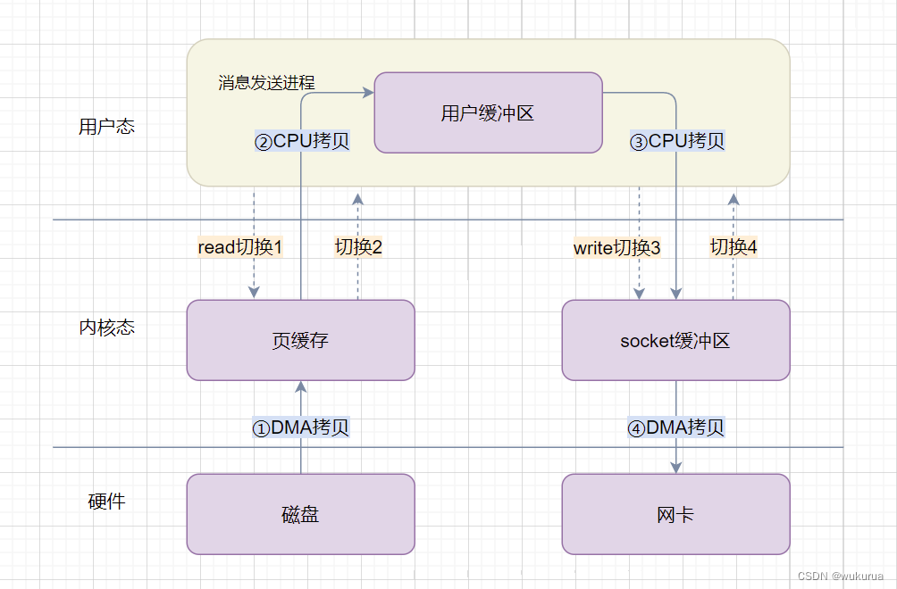
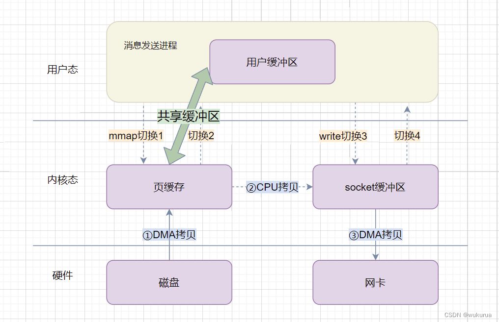
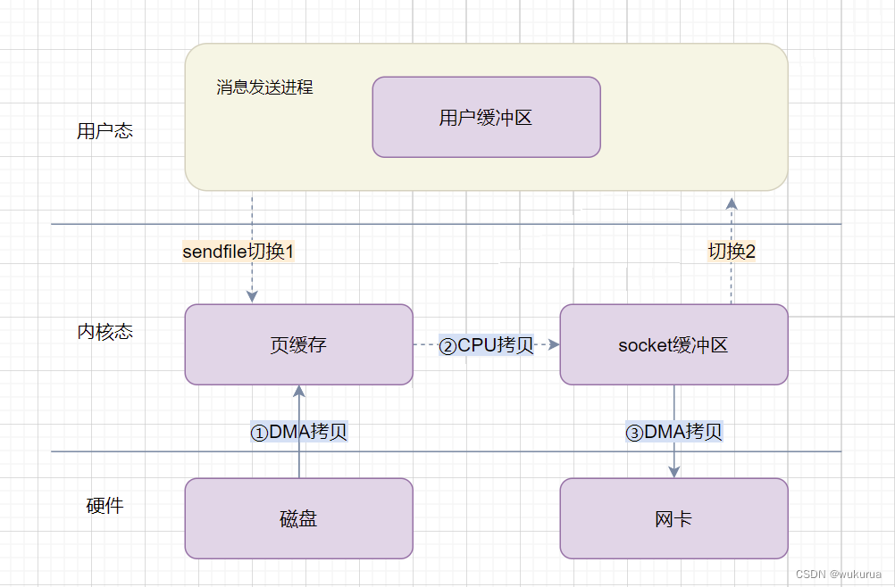
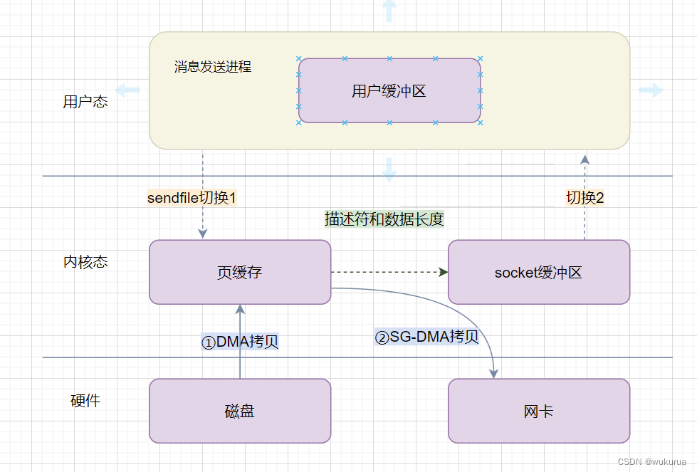

## **11.**RocketMq **零拷贝**

#### 原始版本

一台服务器把本机磁盘文件的内容发送到客户端，一般分为两个步骤：

read：读取本地文件内容；
write：将读取的内容通过网络发送出去。
这两个操作发生了两次系统调用，每次系统调用都得先从用户态切换到内核态，等内核完成任务后，再从内核态切换回用户态，也就是消息发送过程中一共发生了 4 次用户态与内核态的上下文切换。另外还发生了 4 次数据拷贝，其中两次是 DMA 的拷贝，另外两次则是通过 CPU 拷贝的，分别是：



1. DMA把数据从磁盘拷贝到内核态缓冲区；
2. CPU把数据从内核态缓冲区拷贝到用户缓冲区；
3. CPU把数据从用户缓冲区拷贝到内核的网络驱动的 socket 缓冲区；
4. DMA把数据从网络驱动的 socket 缓冲区拷贝到网卡的缓冲区中。

这个消息发送的过程，我们只是发送了一份数据，结果却搬运了 4 次，过多的数据拷贝存在冗余的上文切换和数据拷贝，无疑会消耗 CPU 资源，大大降低了系统性能。这在高并发系统里是非常糟糕的。

所以，要想提高文件传输的性能，就需要减少【用户态与内核态的上下文切换】和【内存拷贝】的次数。通过上面的分析可以看出，第2、3次拷贝（也就是从内核空间到用户空间的来回复制）是没有意义的，数据应该可以直接从内核缓冲区直接送入Socket缓冲区。零拷贝机制就实现了这一点。

#### 零拷贝机制

零拷贝技术实现的方式通常有 2 种：

- mmap + write
- sendfile

#### 1.mmap + write

用mmap()代替reed，那么 mmap 是什么呢？

>man手册里写道：
>
>mmap() creates a new mapping in the virtual address space of the calling process.

mmap() 系统调用函数在调用进程的虚拟地址空间中创建一个新映射。这个映射会直接把内核缓冲区里的数据映射到用户空间，这样就不用从内核空间到用户空间来回复制数据了。



那么之前的过程就变成了如下：

1. 应用进程调用 mmap()，DMA 把数据从磁盘拷贝到内核缓冲区里；
2. 应用进程调用 write()，CPU直接将内核缓冲区的数据拷贝到 socket 缓冲区中；
3. DMA把数据从内核的 socket 缓冲区拷贝到网卡的缓冲区里。

通过上面的分析，我们可以发现，比起原始版本，**mmap + write 的方式依然需要4 次用户态与内核态的上下文切换，但是少了一次内存拷贝。**

RocketMQ 选择了这种 mmap + write 方式，因为这种方式即使频繁调用，使用小块文件传输，效果会比 sendfile 更好。但是这样不能很好的利用 DMA 方式，会比 sendfile 多消耗 CPU， mmap 映射的内存分配与释放的安全性控制复杂，需要避免 JVM Crash问题。

那RocketMQ是如何使用上述的**“零拷贝”**技术，提高消息存盘和网络发送的速度的呢？

> 以下内容來自源码的docs/cn/design.md

RocketMQ 主要通过 MappedByteBuffer 对文件进行读写操作。其中，利用了 NIO 中的 FileChannel 模型直接将磁盘上的物理文件直接映射到用户态的内存地址中（这种 Mmap 的方式减少了传统IO将磁盘文件数据在操作系统内核地址空间的缓冲区和用户应用程序地址空间的缓冲区之间来回进行拷贝的性能开销），将对文件的操作转化为直接对内存地址进行操作，从而极大地提高了文件的读写效率。

org/apache/rocketmq/store/MappedFile#init

```java
private void init(final String fileName, final int fileSize) throws IOException {
    this.fileName = fileName;
    this.fileSize = fileSize;
    this.file = new File(fileName);
    this.fileFromOffset = Long.parseLong(this.file.getName());
    boolean ok = false;

    ensureDirOK(this.file.getParent());

    try {
        this.fileChannel = new RandomAccessFile(this.file, "rw").getChannel();
        this.mappedByteBuffer = this.fileChannel.map(MapMode.READ_WRITE, 0, fileSize);
        TOTAL_MAPPED_VIRTUAL_MEMORY.addAndGet(fileSize);
        TOTAL_MAPPED_FILES.incrementAndGet();
        ok = true;
    } catch (FileNotFoundException e) {
        log.error("Failed to create file " + this.fileName, e);
        throw e;
    } catch (IOException e) {
        log.error("Failed to map file " + this.fileName, e);
        throw e;
    } finally {
        if (!ok && this.fileChannel != null) {
            this.fileChannel.close();
        }
    }
}

```


正因为需要使用内存映射机制，故 RocketMQ 的文件存储都使用定长结构来存储，方便一次将整个文件映射至内存。采用 MappedByteBuffer 这种内存映射的方式一次只能映射 1.5 ~ 2G 的文件至用户态的虚拟内存（为什么最大是2G？–> [解释]([Java文件映射mmap]全接触 (douban.com))）。而且进程虚拟地址空间和内存的映射是以页为单位，因此 mmap 映射区域大小必须是物理页大小的整倍数（通常是4k字节）。这也是为何 RocketMQ 默认设置单个 CommitLog 日志数据文件为1G的原因了。

CommitLog、ConsumerQueue 和 Index 的单个文件都被设计为固定长度，如下：

```shell
[root@rocketmq-nameserver1 slave-store]# cd commitlog/
[root@rocketmq-nameserver2 commitlog]# ll -lh
总用量 20K
-rw-r--r--. 1 root root 1.0G 4月  28 13:59 00000000000000000000


[root@rocketmq-nameserver1 slave-store]# cd consumequeue/base/1
[root@rocketmq-nameserver1 1]# ll -lh
总用量 4.0K
-rw-r--r--. 1 root root 5.8M 4月  27 14:18 00000000000000000000

[root@rocketmq-nameserver1 slave-store]# cd index/
[root@rocketmq-nameserver1 index]# ll -lh
总用量 252K
-rw-r--r--. 1 root root 401M 4月  28 13:38 20220427193727484
```

#### 2. sendfile

>RocketMQ可以说几乎没用到这个方式。
>仅仅在org.apache.rocketmq.common.utils.IOTinyUtils#copyFile里采用了，不过这个方法也就在对应的测试方法里用过。算是完全没用到吧。
>不过这里还是说一说sendfile()吧。
>
>sendfile() copies data between one file descriptor and another. Because this copying is done within the
>kernel, sendfile() is more efficient than the combination of read(2) and write(2), which would require
>transferring data to and from user space.

通过使用`sendfile`()，数据可以直接在内核空间进行传输，因此避免了用户空间和内核空间之间来回复制拷贝，同时由于使用`sendfile`替代了`read + write`从而节省了一次系统调用，也就是2次用户态与内核态的上下文切换。



整个过程发生了2次用户态与内核态的上下文切换和3次内存拷贝，具体流程如下：

应用进程调用sendfile()，DMA控制器把数据从硬盘中拷贝到读缓冲区，上下文从用户态转向内核态；
CPU直接将内核缓冲区的数据拷贝到 socket 缓冲区中；
DMA把数据从网络驱动的 socket 缓冲区拷贝到网卡的缓冲区中，上下文从内核态切换回用户态，sendfile()调用返回。
如果网卡支持 SG-DMA（The Scatter-Gather Direct Memory Access）技术（和普通的 DMA 有所不同），我们可以进一步减少通过 CPU 把内核缓冲区里的数据拷贝到 socket 缓冲区的过程。

在你的 Linux 系统通过下面这个命令，查看网卡是否支持 scatter-gather 特性：

```xml
[root@rocketmq-nameserver1 ~]# ethtool -k eth0 | grep scatter-gather
scatter-gather: on
        tx-scatter-gather: on
        tx-scatter-gather-fraglist: off [fixed]
```

从 Linux 内核 `2.4` 版本开始起，在支持网卡支持 SG-DMA 技术的情况下， `sendfile()` 系统调用的过程发生了点变化，具体过程如下：



1. DMA 将磁盘上的数据拷贝到内核缓冲区里；
2. 缓冲区描述符和数据长度传到 socket 缓冲区，这样网卡的 SG-DMA 控制器就可以直接将内核缓存中的数据拷贝到网卡的缓冲区里，此过程不需要将数据从操作系统内核缓冲区拷贝到 socket 缓冲区中，这样就减少了一次数据拷贝；

也就是说变化后发生了**2次用户态与内核态的上下文切换和2次内存拷贝**。

在Java中可以通过FileChannel.transferTo()来实现数据从文件描述符传输到 socket 中，它的底层是通过sendfile()系统调用来实现。FileChannel.transferTo()只有源为 FileChannel 才支持 transfer 这种高效的复制方式，其他如 SocketChannel 都不支持transfer模式。当然，目的 Channel 没有这种限制。所以一般可以做 FileChannel -> FileChannel 和 FileChannel -> SocketChannel 的 transfer。

原文链接：https://blog.csdn.net/qq_40744423/article/details/124563671


## **12.rocketMq清除文件**

rocketMq主要清除CommitLog、ConsumeQueue的过期文件。

RocketMQ顺序写Commitlog、ConsumeQueue文件，所有写操作全部落在最后一个CommitLog或ConsumeQueue文件上，之前的文件在下一个文件创建后，将不会再被更新。

RocketMQ清除过期文件的方法是：如果非当前写文件在一定时间间隔内没有再次被更新，则认为是过期文件，可以被删除，RocketMQ不会管这个这个文件上的消息是否被全部消费。默认每个文件的过期时间为72小时。可通过配置文件配置fileReservedTime 单位是小时。

### 常见面试题

https://blog.csdn.net/qq_31960623/article/details/119730756