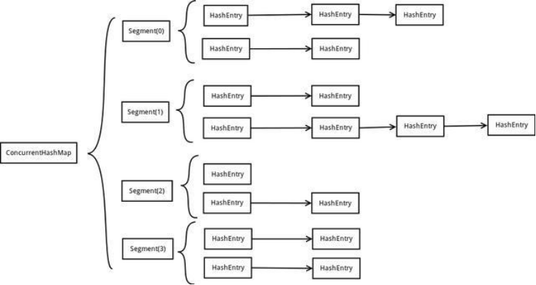
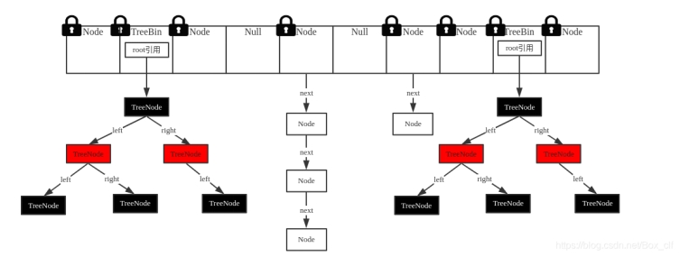
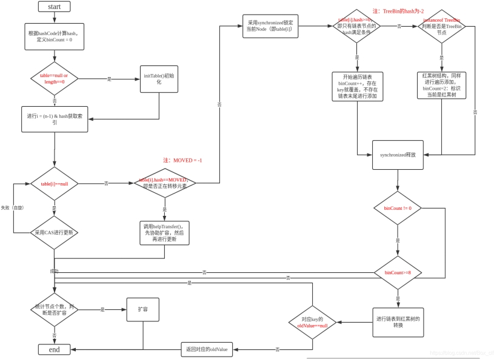

# java基础集合

### 1.ArrayList和LinkedList、vector 区别

##### ArrayList

```java
transient Object[] elementData
底层是数组结构，查询快，增删慢，线程不安全，效率高。
DEFAULT_CAPACITY = 10   扩容是50%
    
改成线程安全的用   
Collections.synchronizedList(new ArrayList<Object>()); 
```

##### LinkedList

```
List<E>, Deque<E>
底层是链表数据结构，查询慢，增删快，线程不安全，效率高。
可以当作队列使用
```


##### Vector

底层是数组结构，查询快，增删慢，线程安全，效率低。 变更操作都加了synchronized

ArrayList和Vector很像 但是ArrayList效率高开辟空间是50%开辟，Vector是一倍。Vector线程安全。


### 2.map

##### HashMap 

```java
java8优化
	每一个元素都是链表的数组，每插入一个元素时都要计算它的Hash值来确定它要插入的数组位置，但是可能存在同一个hash值得元素已经被放在这个数组位置了，这时就添加到同一hash值得元素后面,形成了链表同一个链表上的hash值相同。但是当链长度过长时链表就会转成红黑树，这样就增加了查询效率。（java8增加了红黑树和扩容的优化），链表长度大于8会转换为红黑树在存储，这样查找速度更快。
    这边也可以引申到一个问题HashMap是先插入还是先扩容：HashMap初始化后首次插入数据时，先发生resize扩容再插入数据，之后每当插入的数据个数达到threshold时就会发生resize，此时是先插入数据再resize。
    优化了扩容：java7是每次扩容都需要重新计算异常hash值，而java8 计算方式不一样，元素的位置要么是在原位置，要么是在原位置再移动2次幂的位置。
比如容量是4的话，key的hash值是3和7除4取余都是3会放到一个链表中，当扩容后3在3的位置 7在7的位置。
```


##### HashTable 

是线程安全的  key和value不允许为null

##### ConcurrentHashMap

##### **在JDK1.7中**

ConcurrentHashMap采用了数组+Segment+分段锁的方式实现。

1.Segment(分段锁)

ConcurrentHashMap中的分段锁称为Segment，它即类似于HashMap的结构，即内部拥有一个Entry数组，数组中的每个元素又是一个链表,同时又是一个ReentrantLock（Segment继承了ReentrantLock）。



坏处：这一种结构的带来的副作用是Hash的过程要比普通的HashMap要长

好处：写操作的时候可以只对元素所在的Segment进行加锁即可，不会影响到其他的Segment，这样，在最理想的情况下，ConcurrentHashMap可以最高同时支持Segment数量大小的写操作（刚好这些写操作都非常平均地分布在所有的Segment上）。


##### **在JDK1.8中**

JDK8中ConcurrentHashMap参考了JDK8 HashMap的实现，采用了数组+链表+红黑树的实现方式来设计，内部大量采用CAS操作



###### Put流程

1. 如果没有初始化就先调用initTable（）方法来进行初始化过程

2. 如果没有hash冲突就直接CAS插入

3. 如果还在进行扩容操作就先进行扩容

4.  如果存在hash冲突，就加锁来保证线程安全，这里有两种情况，一种是链表形式就直接遍历到尾端插入，一种是红黑树就按照红黑树结构插入，

5. 最后一个如果该链表的数量大于阈值8，就要先转换成黑红树的结构，break再一次进入循环(阿里面试官问题，默认的链表大小，超过了这个值就会转换为红黑树);

6. 如果添加成功就调用addCount（）方法统计size，并且检查是否需要扩容

   

##### Hash表

内部哈希表底层依赖两个方法：hashCode()和equals()

>执行顺序：
>
>首先比较哈希值是否相同
>
>​    相同：继续执行equals()方法
>
>​        返回true：元素重复了，不添加
>
>​        返回false：直接把元素添加到集合
>
>​    不同：就直接把元素添加到集合

##### TreeMap

内部是红黑树

TreeMap继承AbstractMap，实现NavigableMap、Cloneable、Serializable三个接口。

其中AbstractMap表明TreeMap为一个Map即支持key-value的集合 NavigableMap则意味着它支持一系列的导航方法，具备针对给定搜索目标返回最接近匹配项的导航方法 。

内部通过comparator比较器来完成比较。

>### Comparable和Comparator区别比较
>
>Comparable是排序接口，若一个类实现了Comparable接口，就意味着“该类支持排序”。而Comparator是比较器，我们若需要控制某个类的次序，可以建立一个“该类的比较器”来进行排序。
>
>Comparable相当于“内部比较器”，而Comparator相当于“外部比较器”。
>
>Comparable 
>
>实现 Comparable接口
>
>重写ComparableTo
>
>Array.sort()

##### 常用List集合初始化方式

- 使用Arrays的静态方法asList初始化。返回的list集合是不可变的！

- 使用Stream（JDK8以上）

  使用JDK8引入的Stream的of方法生成一个stream对象，调用collect方法进行收集，形成一个List集合

  ```java
  List<Integer> list = Stream.of(1, 2, 3).collect(Collectors.toList());
  ```

  

##### java8 Stream

Stream中的操作可以分为两大类：中间操作与结束操作, 中间操作只是对操作进行了记录，只有结束操作才会触发实际的计算（即惰性求值），这也是Stream在迭代大集合时高效的原因之一